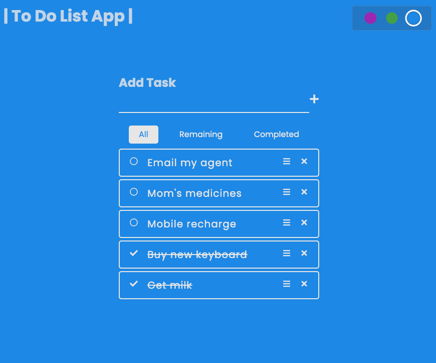

## UI Screenshot

## Project Intro

To-Do List App built using React and React-Beautiful-DND.

- User can add and remove a task
- Edit the incomplete tasks
- Check the completed tasks
- Rearrange tasks using Drag and Drop
- Tasks are arranged into 3 categories: All, Remaining and Completed.
- User can change the color of app using the Color picker

## Topics Covered

- React Components, Props
- React Hooks: useState and useEffect
- Child-to-Parent and Parent-to-Child communication using props
- Lifting State Up
- JS Modules
- JS Higher Order Function: Map and Filter
- CSS Flex Box

## Available Scripts

1. Install all needed NPM packages by typing: `npm install` in the current directory terminal.

2. To Run the app type `npm start` in the terminal.
